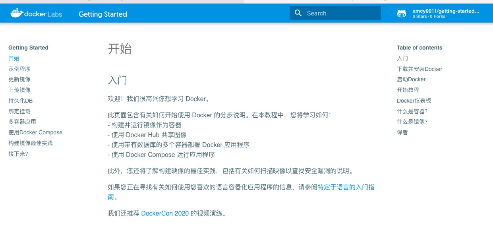

# 官方Docker入门教程中文翻译（Docker Getting Started Tutorial）

## 介绍



<!-- This tutorial has been written with the intent of helping folks get up and running
with containers and is designed to work with Docker Desktop. While not going too much 
into depth, it covers the following topics: -->
本教程旨在帮助人们（那些从没有接触过Docker的）学习Docker容器，适用于Docker Desktop（Mac/Windows）。

这是一个入门教程，不会介绍高深的原理，但是它面面俱到。它涵盖了以下主题：

<!-- - Running your first container -->
- 运行您的第一个容器
<!-- - Building containers -->
- 构建容器
<!-- - Learning what containers are running and removing them -->
- 学习查看那些容器正在运行和如何移除它们
<!-- - Using volumes to persist data -->
- 使用容器卷（volumes）持久化数据
<!-- - Using bind mounts to support development -->
- 介绍在开发环境使用绑定挂载（bind mounts）的技巧
<!-- - Using container networking to support multi-container applications -->
- 使用容器网络（container networking）来实现多容器应用
<!-- - Using Docker Compose to simplify the definition and sharing of applications -->
- 使用Docker Compose来简单的定义（编排）我们的容器和分享应用
<!-- - Using image layer caching to speed up builds and reduce push/pull size -->
- 学习镜像分层缓存（image layer caching）来加速构建和减小镜像大小，以加速推拉镜像的速度（从DockerHub中）
<!-- - Using multi-stage builds to separate build-time and runtime dependencies -->
- 使用多阶段构建（multi-stage builds）来分离编译时依赖和运行时依赖，来减小镜像体积和提高最终镜像的安全性

<!-- ## Getting Started -->
## 入门

<!-- If you wish to run the tutorial, you can use the following command after installing Docker Desktop: -->

如果您希望运行本教程，您可以使用以下命令（请确保您安装了Docker Desktop）：

英文原版：
```bash
docker run -d -p 80:80 docker/getting-started
```

中文翻译：
```bash
docker run -d -p 80:80 xmcy0011/getting-started-cn
```

<!-- Once it has started, you can open your browser to [http://localhost](http://localhost). -->
当启动成功后，您可以打开浏览器并访问 [http://localhost](http://localhost) 查看。

## GitPages

当然，您可能只想看看的话，请访问本教程的在线网站吧：
- 官方英文原版：[https://docs.docker.com/get-started/](https://docs.docker.com/get-started/)
- 中文翻译版：[https://xmcy0011.github.io/getting-started-cn/tutorial/](https://xmcy0011.github.io/getting-started-cn/tutorial/)

<!-- ## Development -->
## 开发本教程

<!-- This project has a `docker-compose.yml` file, which will start the mkdocs application on your
local machine and help you see changes instantly. -->
本教程有一个 `docker-compose.yml` 文件，它会在您本地的机器启动mkdocs应用，这样能帮助您查看实时的改动：

```bash
docker-compose up
```

当然，您也可以直接在根目录下执行：
```bash
mkdocs serve
```

然后访问：[http://127.0.0.1:8000](http://127.0.0.1:8000/) 查看效果。

## Contributing

<!-- If you find typos or other issues with the tutorial, feel free to create a PR and suggest fixes!

If you have ideas on how to make the tutorial better or new content, please open an issue first before working on your idea. While we love input, we want to keep the tutorial  scoped to newcomers.
As such, we may reject ideas for more advanced requests and don't want you to lose any work you might
have done. So, ask first and we'll gladly hear your thoughts! -->
如果你在教程中发现拼写错误或其他问题，请随意创建PR并提出修复建议！如果你对如何改进本教程或增加新内容有想法，请先打开一个问题，然后再继续你的想法。虽然我们喜欢输入，但我们希望本教程只适用于`新手`。

因此，我们可能会拒绝更高级的请求，并且不希望您失去任何可能的工作。所以，先问问吧，我们会很高兴听到你的想法！

## ChangeLog

- 2022-02-11 初稿完成

## 译者

- github：https://github.com/xmcy0011
- 公众号：Go和分布式IM
- 最后更新日期：2022-02-11

如果感觉译者翻译的还可以，就关注一下公众号吧，目前已有69个粉丝，您的支持就是我最大的动力！

